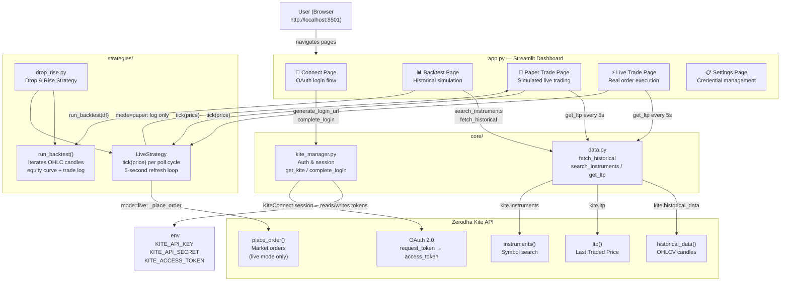

# Architecture

Kite Trader is a local Streamlit dashboard for backtesting and live-trading Indian equities on Zerodha Kite using a **Drop & Rise** strategy: buy when price drops a configurable percentage from its recent high, sell when it rises a configurable percentage from the buy price.

## Component Summary

| Component | File | Role |
|-----------|------|------|
| Dashboard | `app.py` | Streamlit UI, page routing, session state, Plotly charts |
| Auth | `core/kite_manager.py` | KiteConnect OAuth, token persistence to `.env` |
| Data | `core/data.py` | Historical OHLCV fetch, instrument search, live LTP |
| Strategy | `strategies/drop_rise.py` | Drop & Rise logic for backtest, paper, and live modes |
| Kite API | external | Zerodha broker API (auth, data, order placement) |
